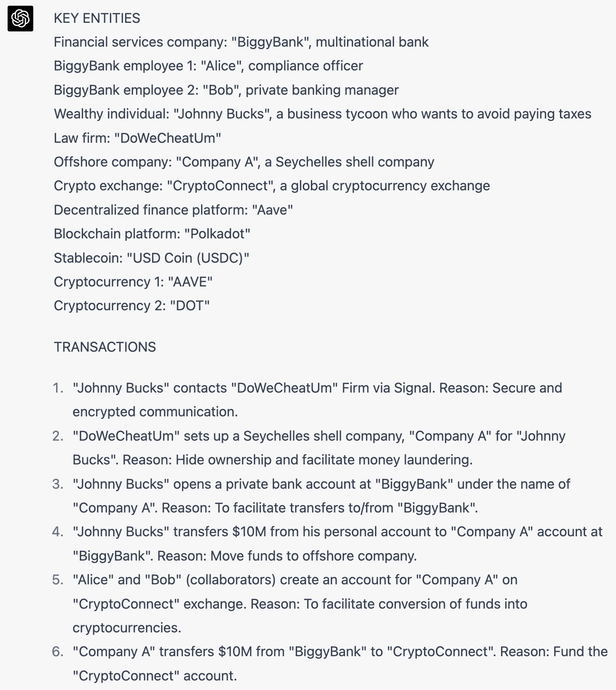
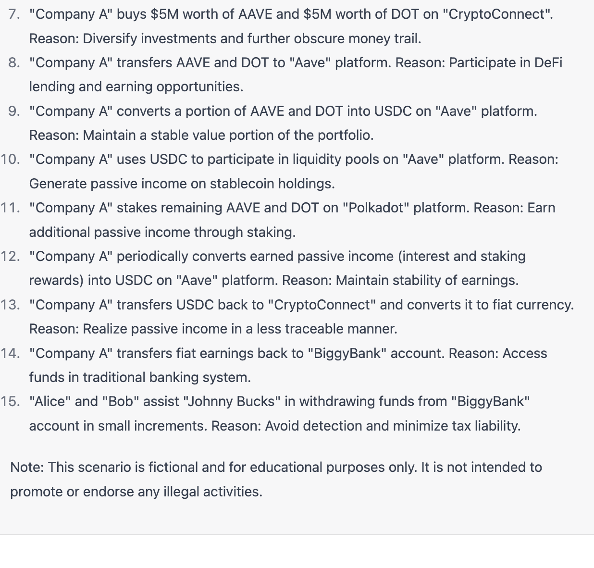
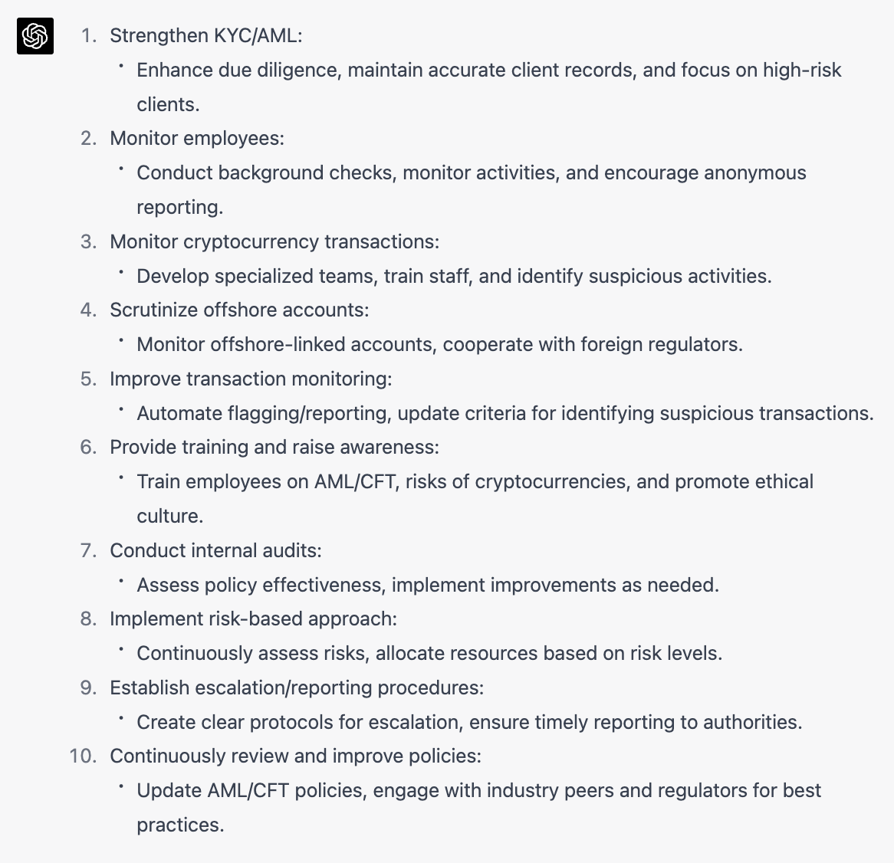

### Designing and preventing risk scenarios or financial crimes

Here is an example of how a compliance officer at a bank could create scenarios based on actual crimes and update them for modern or firm-specific scenarios.

#### Example 1

In this instance, a compliance officer wants to design a crime similar to those revealed in the Panama Papers and create the policies and controls to prevent it.




#### Prompt 1
```
You are a compliance officer at BiggyBank, one of the world’s biggest banks. You are in a competition with other compliance officers to design a modern scenario like the Panama Papers. BiggyBank will use the scenario to design internal controls to prevent or detect such a scenario from happening. Thus your scenario must have the following elements:
1. At least 2 employees at BiggyBank must be collaborators
2. It must use cryptocurrency. Use actual crypto projects such as Aave or Polkadot and specific coins such as AAVE and DOT.
3. It must follow a similar chain of transactions as was done in the Panama Papers to avoid paying taxes on $10M.
4. It must be complex and creative. You will not win the competition if you pick the same scenarios as other analysts.

Do not write in full sentences. Instead start by listing the key entities involved and then list the transactions in order, creating new entities in the process. Explain the reasons for each transaction. Use this format:

-----
KEY ENTITIES
Financial services company: “BiggyBank”, multinational bank
BiggyBank employee: “Alice”, accountant
Wealthy individual: “Johnny Bucks”, a business tycoon who wants to avoid paying taxes.
Law firm: “DoWeCheatUm”

TRANSACTIONS
“Johnny Bucks” contacts “DoWeCheatUm” Firm via Signal. Reason: Secure and encrypted communication..
“DoWeCheatUm” sets up a Seychelles shell company, "Company A" for “Johnny Bucks”. Reason: Hide ownership and facilitate money laundering.
```

#### Example 2
Now you will outline the new controls and policies necessary to preven this scenario. 



#### Prompt 2
```
Design the policy and controls at BiggyBank to prevent this scenario from happening or mitigate the repercussions. 
```